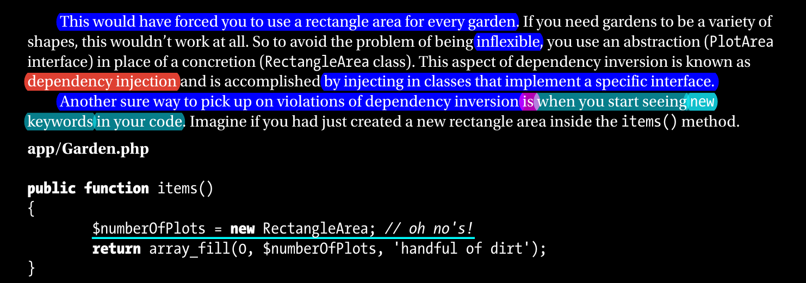
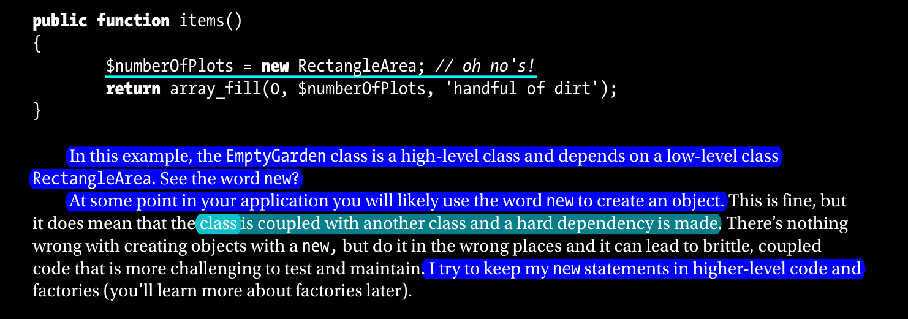

# Dependency Injection (DI)

> Dependency Injection is a technique to achieve Inversion of Control (IoC) by injecting dependencies into a class's constructor, method, or property.

> also states that one should depend on abstractions, not on concretions.

What is that means?

are you remember our last example about `EmptyGarden` class? which was accepting `Rectangle` area always, and when we want triangle area, it was not possible to do that, because `EmptyGarden` class was depending on `Rectangle` class.

so, we can say that `EmptyGarden` class was depending on concretions, not on abstractions.

so, to follow the Dependency Injection principle, we should depend on abstractions, not on concretions.

let's see how we can do that.

```php
interface Area {
    public function area();
}

class Rectangle implements Area {
    private $width;
    private $height;

    public function __construct($width, $height) {
        $this->width = $width;
        $this->height = $height;
    }

    public function area() {
        return $this->width * $this->height;
    }
}

class Triangle implements Area {
    private $base;
    private $height;

    public function __construct($base, $height) {
        $this->base = $base;
        $this->height = $height;
    }

    public function area() {
        return 0.5 * $this->base * $this->height;
    }
}

class EmptyGarden {
    private $area;

    public function __construct(Area $area) {
        $this->area = $area;
    }

    public function area() {
        return $this->area->area();
    }
}
```

now, we can use `EmptyGarden` class with any area, because it's depending on `Area` interface, not on `Rectangle` or `Triangle` classes.

```php
$rectangle = new Rectangle(10, 10);
$triangle = new Triangle(10, 10);

$garden = new EmptyGarden($rectangle);
$garden->area(); // 100

$garden = new EmptyGarden($triangle);
$garden->area(); // 50
```

this is the Dependency Injection principle, we injected the `Area` interface into `EmptyGarden` class, and we can use it with any class implements `Area` interface.

---

- [SOLID Principles](../readme.md)



Dependency Injection `EmpyGarden` is a High-level module, and `Rectangle` and `Triangle` are Low-level modules, and `Area` is an abstraction, so we can say that `EmpyGarden` class is depending on abstractions, not on concretions.

so when you see `new` keyword inside a high-level module, you may face a violation of the Dependency Injection principle.



In Software Engineering, there is saying "Low Coupling, High Cohesion", and Dependency Injection principle is one of the ways to achieve that.

**Coupling**: is the degree of interdependence between software modules; a measure of how closely connected two routines or modules are; the strength of the relationships between modules.
degree to which one class relies on another class.

**Cohesion**: is the degree to which the elements of a module belong together.

let's consider the class is island, and
